# Building the FauxNeXT
These instructions are a work-in-progress. As problems are noted or suggestions arise, I will update the instructions. Thank you for your patience. Throughout the Instructions when I am referring to a printed part, I will italicize the name. For example: *MainLeg*. As of this writing (August 2024), these instructions are only for the [NeXT MegaPixel Display](https://en.wikipedia.org/wiki/NeXT_MegaPixel_Display) (MPD). In the future other models may be added such as a [NeXTstation](https://en.wikipedia.org/wiki/NeXTstation) and/or a NeXT Sound Box.

Below are some reference images of the assembled model. 

[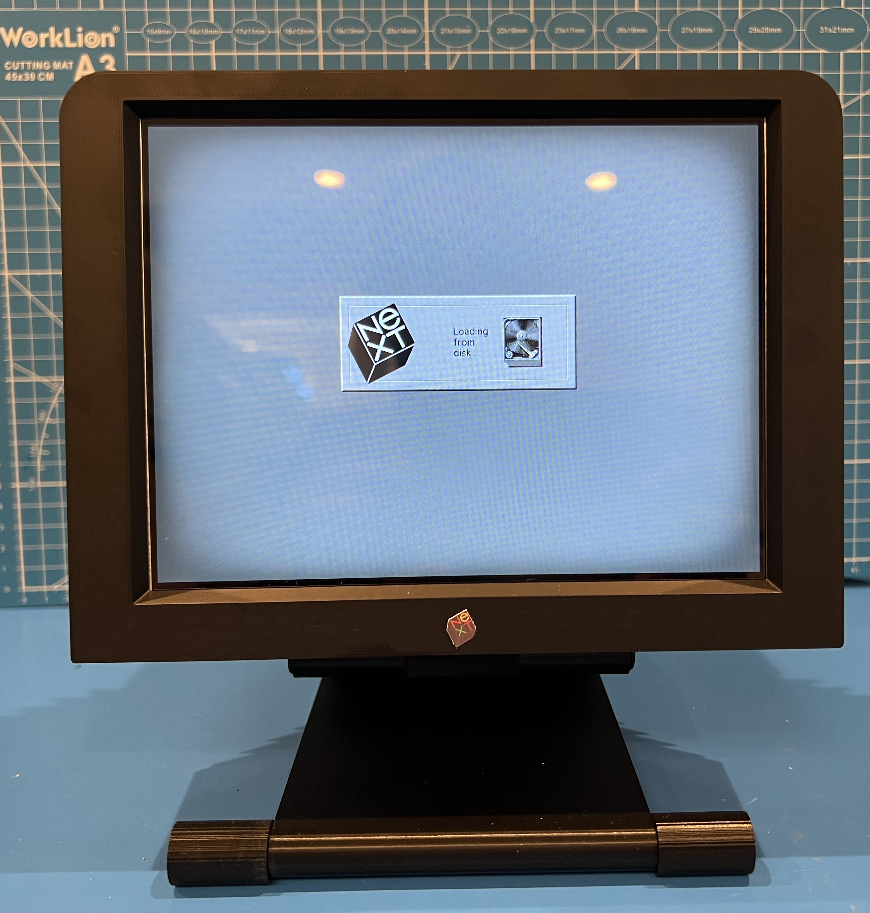](images/Actual/Booting.jpeg)
[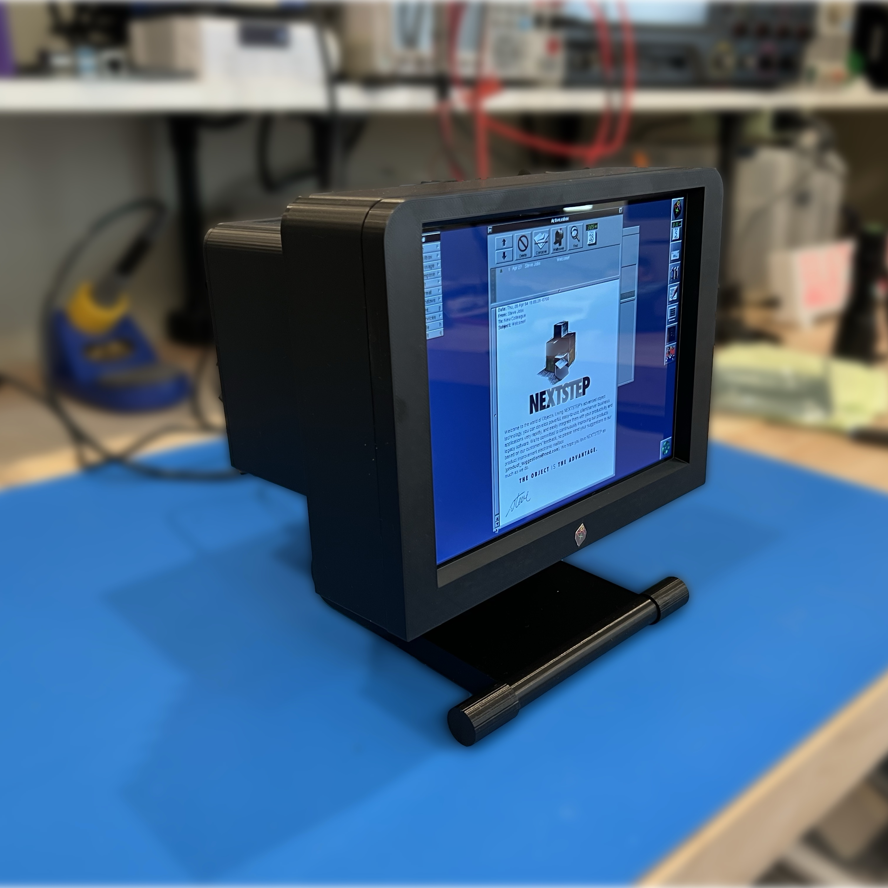](images/Actual/FrontLeft.jpeg)

[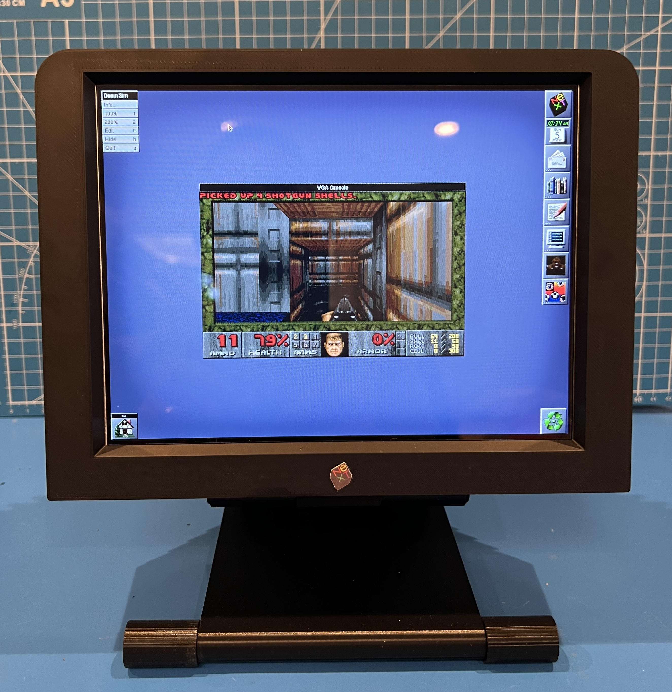](images/Actual/Doom.jpeg)
[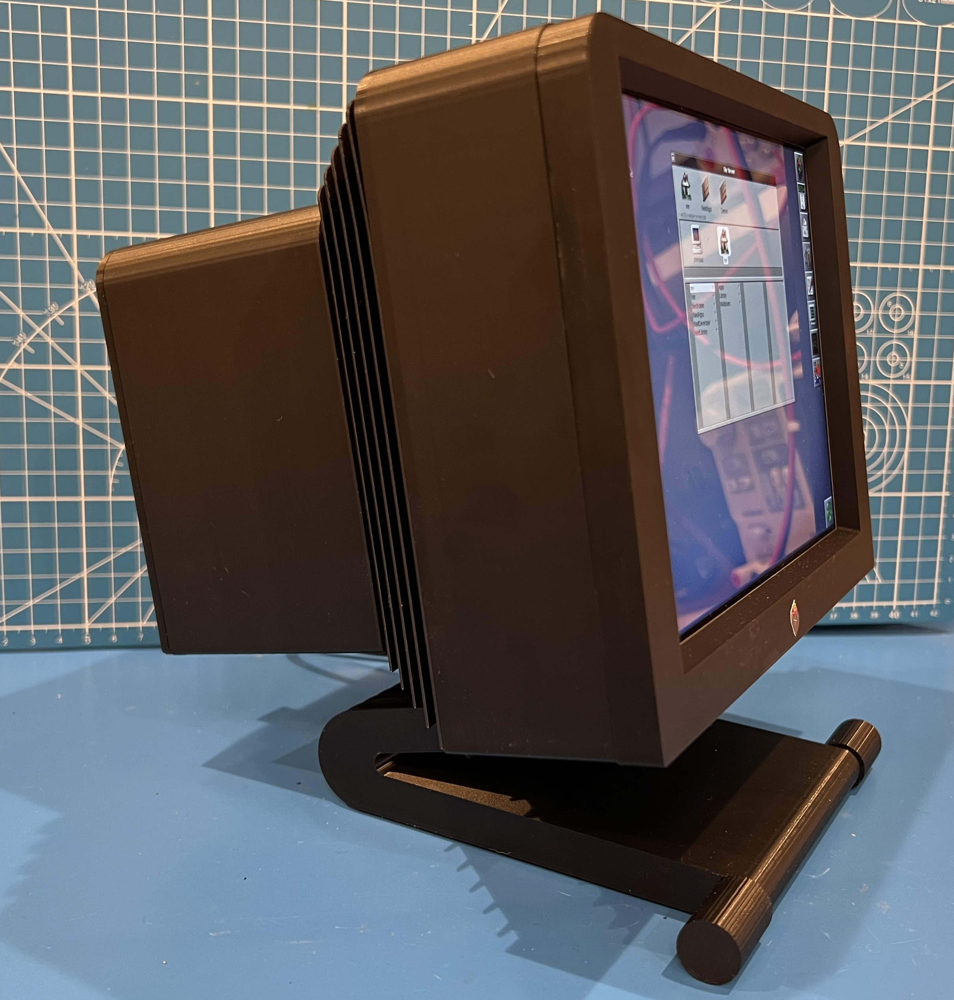](images/Actual/SideViewBooted.jpeg)
[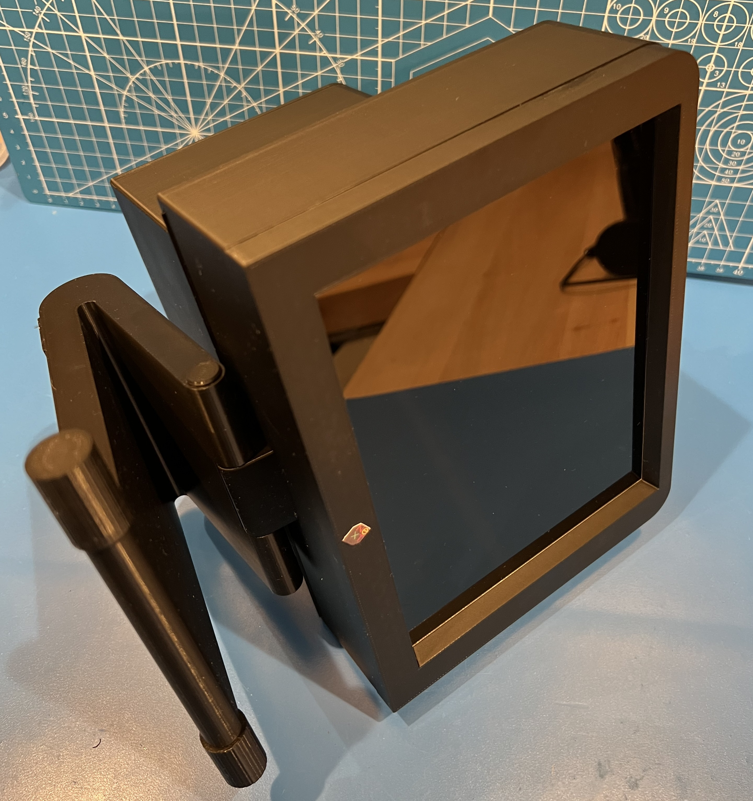](images/Actual/ObliqueView.jpeg)
[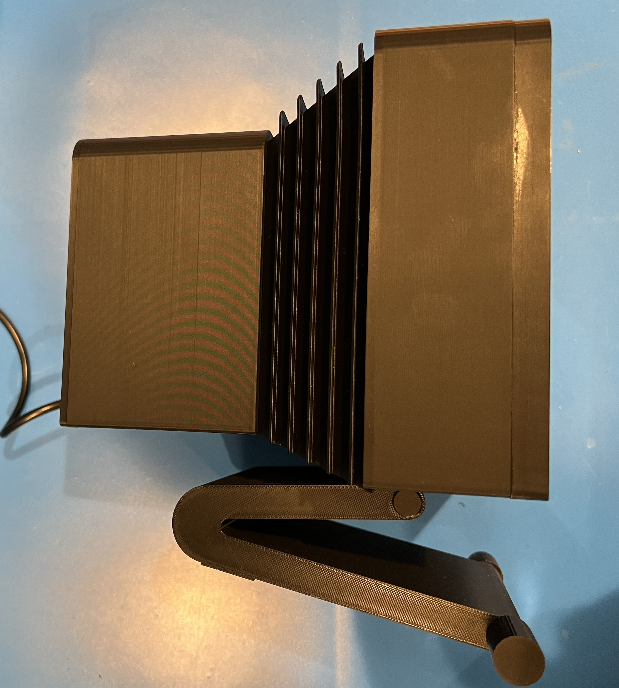](images/Actual/SideView.jpeg)
[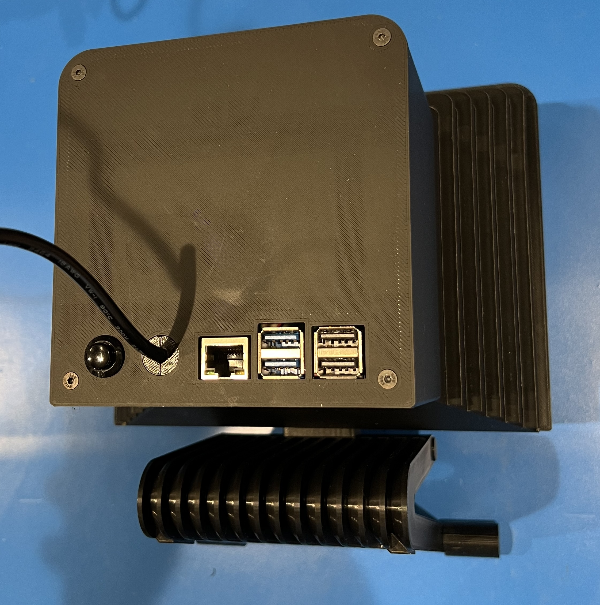](images/Actual/BackView.jpeg)

## Required Supplies

### Required Electronics (and where to source)

* **Raspberry Pi 4/5**. I tried both a model 4 and a model 5. I ended up using a Pi 5, but the Pi 4 is adequate. There are many places to source these. To find one you can use [rpilocator](https://rpilocator.com/).
* **Power Supply**. You will need a hefty USB-C power supply for this since it is powering the Pi itself, the display, and any attached USB peripherals like USB speakers. You don't want to skimp here. If you do, you are likely to get "Low Voltage" warnings from the Pi. For a Pi 4, the [CanaKit Pi 4 Power Supply](https://www.amazon.com/gp/product/B07TYQRXTK) has worked for me, though  For a Pi 5 I have had success with a [GeeekPi 27W Power Supply](https://www.amazon.com/gp/product/B0CQ2DL2RW). I'm sure there are many others that will work, but what won't work is an old phone charger with a random USB cable.
* **8" 1024x768 Display**. The MPD has an odd display resolution. The 17" monitor had 1120 × 832 pixels at 92 DPI. This is 4x3 aspect ratio so I chose a similar size and shape: 1024x768. As the model is 50% scale, I used an 8" display. I had to modify the bezel a bot to accomodate this. I got my display and controller card on [ebay](https://www.ebay.com/itm/163726876776).
* **Keyboard**. There were a couple of different models of NeXT keyboard. I didn't recreate any of them. At this point, just use a small USB or bluetooth keyboard (and mouse) of your choosing,
* **HDMI Cable**: The display connects to the Raspberry Pi via HDMI, but there is not a lot of room for bulky HDMI cables. I used a flat-flex cable with an up-angle HDMI connector for the display and a micro-HDMI connector for the put. I used [this cable](https://www.amazon.com/JSER-Degree-Angled-Multicopter-Photography/dp/B072PVG4B4), but others are available that will fit. You can mix and match ends or buy a cable with both ends supplied (check the supplier's Amazon store).
* **Power switch**. The Pi 5 accomodates a soft power switch. You'll need a standard momentary push button. I used one which I had "in stock", but any 12mm switch will do, such as [this one](https://www.amazon.com/Momentary-Waterproof-Pushbutton-Pre-Wired-Automotive/dp/B0C8HLLGYG) on Amazon. If you use a Pi 4, a soft power switch is not supported.
* **Boost Converter**. The display runs on 12V, so you'll need to boost the 5V supply coming in. There are lots of available boost converters. The *Display_Retainer* has mounting spots for [this one](https://www.amazon.com/gp/product/B0833SQF8Z).
* **Wires**
	* **Bits of Wire**. You'll need a few bits of wire to connect the Pi 5 to the soft power switch, the Boost Converter to power out from the Pi, and the display to the Boost converter.
	* **Wired Connectors**. To make FauxNeXT easier to assemble/dis-assemble you may wish to use [wires with connectors](https://www.amazon.com/gp/product/B0CKYNMGHL) between various components. You can see where I used connectors in the [images of the wiring](#WiringImages).
	* **Wired Dupont Connectors**. You'll need (4) wires, (2) black and (2) red, with a female Dupont connector on one end of each. If you have a female/female dupont cable you can cut it in half to get two. These are readily available from lots of sources. For example, [here is a set](https://www.amazon.com/California-JOS-Breadboard-Optional-Multicolored/dp/B0BRTJQGS6) from Amazon. 

### Required Hardware

You will need an assortment of screws and magnets to assemble the model:

* (8) M3x4 countersunk screws
  * (4) To attach the *Back_Plate* to the *Rear_Shell*
  * (4) To attach the *Display_Retainer* to the *Bezel*
* (6) M3x4 cap head screws
	* (2) To attach the *Shroud* to the *Rear_Shell*
	* (2) To attach the Boost Converter to the *Display_Retainer*
	* (2) To attach the display board to the *Display_Retainer*
* (6) M2x4 cap head screws
	* (4) To attach the Raspberry Pi to the *Rear_Shell* and *Shroud*
	* (2) To attach the strain relief to the *Back_Plate*
* (2) M3x6 cap head screws to clamp the display board with the *Display_Retainer_Clamps*
* (3) M4 Washers
  * (2) For the *HingeElement* (on on each side)
  * (1) For the hinge bolt
* (8) 6mm round magents (3mm deep) to attach the *Bezel* to the *Shroud*
* (1) M4x90 screw for the hinge area. If you decide to glue the hinge into a fixed position, this is not needed. [Available on Amazon](https://www.amazon.com/gp/product/B07CHFTJKN).
* (1) M4x120 threaded rod for the rolling feet. If you use the fixed feet, this is not needed. [Available on Amazon](https://www.amazon.com/dp/B0C94ZD458).

Refer to the [reference images](#HardwarePlacement) in the Assembly section for placement.

### Filament

I used PLA for all components, but for no other reason than it is what I normally use and my models won't be in an environment where the properties of other filaments will be required. If this turns out to be untrue, I will update this note.

* **Black**:
	* All of the parts are printed in black. I haven't color matched the original MPD. I've tried a couple of blacks and at the moment am using [Hatchbox](https://www.amazon.com/gp/product/B00J0ECR5I), but I plan to try a matte black as well and may update this note.
	* The internal parts such as the Display_Retainer can be printed in whatever filament is convenient.
	* If you are using the rolling version of the front feet, you could experiment with a softer filament to give them some grip. I have not done so.

### Other
* **CA Glue**: A small amout of CA glue is needed to attach various parts together. At a minimum you will need glue to attach magnets to the *Bezel* and the *Shroud*. Yo umay choose to use glue in other spots versus screws. Anywhere this is an option it will be called out below.
* **Patience**: This can go a long way towards a successful build.

## Gluing vs. Screwing

There are several parts of the model that are screwed together so that it can be disassembled. This was important when I was building and refining the model, but you may decide that you want it attached together permanently and choose to use glue rather than screws. Here are the places where this is an option:

* Connecting the *Fin_Area* to the *Shroud*: The *Fin_Area* into a dovetail in the *Shroud* and is held in place with the *Top_Retainer*. Alternatively you can just add some CA glue before sliding the parts together and skip the retainer and screws.
* Connecting the *Hinge_Center* to the *Shroud*: These parts are normally connected using two M4 screws, but you can choose to use glue instead. I'm a bit leary of this option, but it should be plenty strong.
* Connecting the *Rear_Shell* to the *Fin_Area*: These parts are normally held together with (4) screws, but they can be glued together. Note that alignment is critical since the raspberry pi spans these parts and the screw holes used to mount the Pi must be aligned properly.
* Connecting the *Fixed_Feet* to the *Main_Leg*: If you don't want the roller feet to actually roll, you can glue the *Fixed_Feet* into the *Main_Leg*
* Connecting the *Hinge_Center* to the *Main_Leg*: If you don't need the display to pivot up and down on the base, you can glue these components together rather than using the long M4 bolt. The glue joint must be strong since this supports the full weight of the main display.

## Printing the Parts

Printing and assembling this model will take some time. Several of the components took 3+ hours to print on a BambuLab X1. All models are provided as `.3mf` files rather than `.stl` files. They will work the same in your slicer of choice. All of the 3MFs will import into your slicer in the orientation in which I printed them. Components that need supports have “(NS)” in the name. I used tree supports and removing them was fairly easy. All parts may be printed with a 0.2mm layer height. Some of the components have multiple options listed below. Print only one of each option.

* [OPTION] ***Back_Plate_Pi4.3mf*** OR ***Back_Plate_Pi5.3mf***: Choose the back plate option that corresponds to the Raspberry Pi model that you are using (Pi 4 or Pi 5). This prints the back cover and a strain relief that is used for the power cable.
* ***Bezel.3mf***. This is the front of the display and the part you will see the most. Make sure to use a smooth, clean surface when printing this.
* ***Display_Retainer.3mf***. This interior component consists of the main display bracket and two small clips that are used to hold one side of the display board. The other side of the board is screwed directly into the retainer.
* ***End_Caps.3mf***. This consists of two copies of the same cap. One cap will go into each side of the hinged are of the base to conceal the hardware.
* ***Fin_Area (NS).3mf***. This model prints on the flat base which means it sits on the bed at an angle. Supports are required to print the top lip properly.
* [OPTION] ***Fixed_Feet.3mf*** OR ***Rolling_Feet.3mf***. If you'd like the "roller feet" to actually roll, print the rolling version, otherwise print the fixed version. Each option contains two feet.
* ***Hinge_Center.3mf***. This gets screwed into the shroud and is a simple print.
* ***Main_Leg (NS).3mf***. This part is printed on it's side and does require supports. Note however that sacrifical supports are built in to the two lower holes. This is a single layer that allows your printer to bridge an area rather than support it. In this model you can break the bridge by inserting the bolt and pushing through that layer. See [this image](images/Model/LegSupports.jpeg) of the model in a slicer where I set the areas where supports are not needed.
* ***Rear_Shell.3mf***. This component is oriented such that it does not need supports for the grate area. However, if your printer does not handle bridges well, you may need supports in the "grate" area.
* ***Shroud.3mf***. This component does require  some small bridges, but does not require supports.
* ***Top_Retainer.3mf***. This component supports the *Fin_Area* after it slides into the *Shroud*. If you plan to glue the parts together, this part is not required.

## Assembly

After printing the parts, removing supports, and doing any other cleanup/post-processing that you deem necessary, you are ready to assemble the model. The steps below are for the physical assembly, but you'll need to do the wiring along the way. An overview of the wiring is given in a separate section, but is called out in the steps below.

This exploded view of the model gives a sense of the main components and how they relate to one another.
[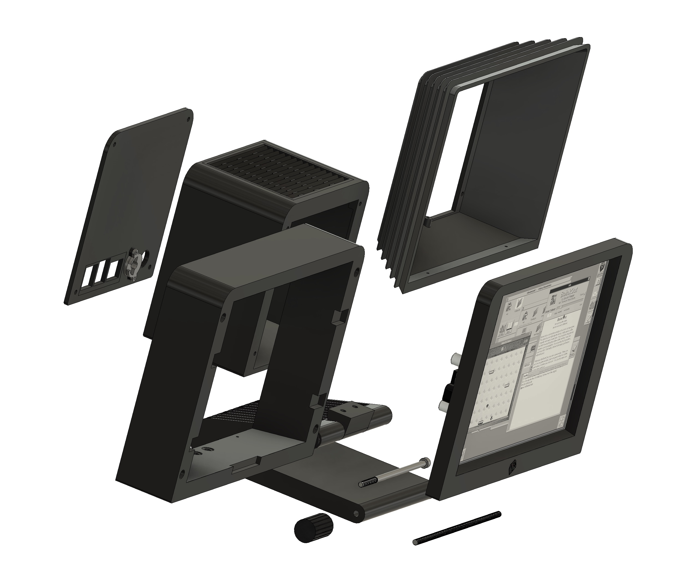](images/Assembly/ExplodedView.jpeg)

All of the screws mount directly into the plastic of the model. You may want to run some screws into the holes a bit to make it easier to start the screws during the actual assembly process. Do no over-tighten.

1. Magnets
  2. Using a small dab of CA glue, affix a magnet into each corner of the *Shroud*. To establish the proper orientation for the four remaining magnets, stick them magnetically to the glued magnets. Make a mark on the visible face of these magnets. The mark should indicate which corner that magnet goes in, and its orientation. For example, you might write "LL" on the magnet that goes in the lower left corner.
  1. Using a small dab of CA glue, affix one of the marked magnets into each corner of the *Bezel*. The marked face of the magnet goes into the recess. It is critical to get the orientation right, so double-check before gluing.
1. Peel off the clear protective plastic from the front of the display and place it into the recess in the *Bezel*. Now lay the *Display_Retainer* on top of the display and attach with (4) countersunk M3x4 screws. Place the display board on top of the *Display_Retainer* and attach the left side with M3 screws. Using the clips that printed with the *Display_Retainer*, secure the right side of the display board.
2. Very carefully attach the flat-flex cable from the display to the connector on the display board. It is very easy to rip this cable and extremely hard to fix it. [See this photo](images/Assembly/NNN.jpeg) proper orientation.
3. Using (4) M3 screws, attach the *Fin_Area* to the *Rear_Shell*. The screws are inserted from the *Fin_Area* and thread into the *Rear_Shell*.
1. Install the Raspberry Pi using four M2 screws. Note that two screws go into the *Rear_Shell* and the other (2) go into the *Fin_Area*.
2. If you're using a Raspberry Pi 5, install the power switch into the *Back_Plate*
3. The USB-C connector from your power supply routes through the opening in the *Rear_Shell* and is held in place by the strain relief. Route the cable through the strain relief pieces as shown [here](images/Assembly/SR1.jpeg) and [here](images/Assembly/SR2.jpeg). Adjust the length of the cable on the inside of the *Rear_Shell* so that it comfortably reaches the USB port on the Pi. Secure the strain relief to the *Back_Plate* using (2) M2 screws
2. Perform the wiring as described below.
1. After testing the unit, snap the *Bezel* to the *Shroud*. The magnets will hold it in place.
2. Have a break then move on to Software Setup.

**Hardware Placement**:

[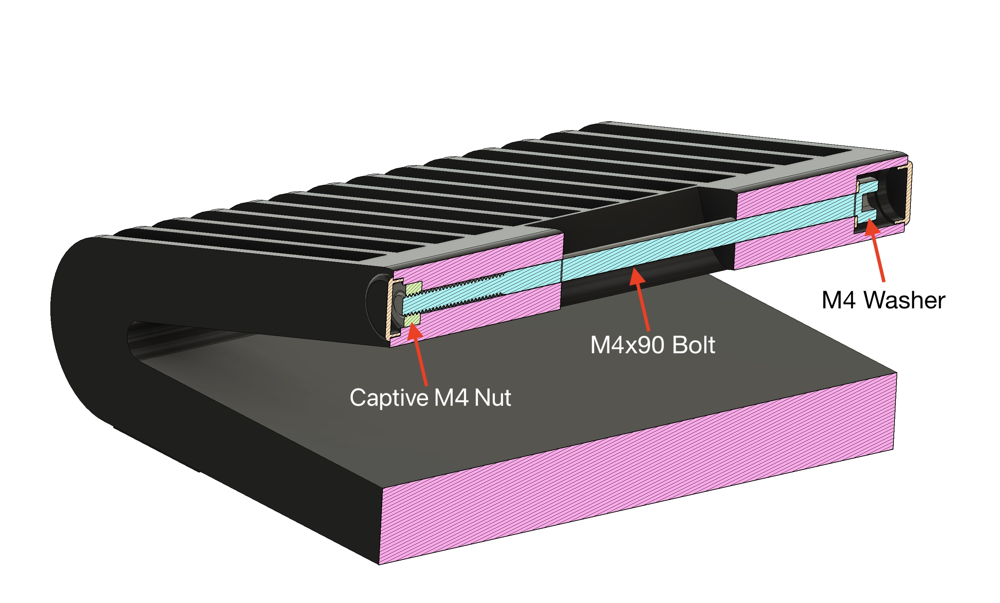](images/Assembly/HW/HingeScrew.jpeg)
[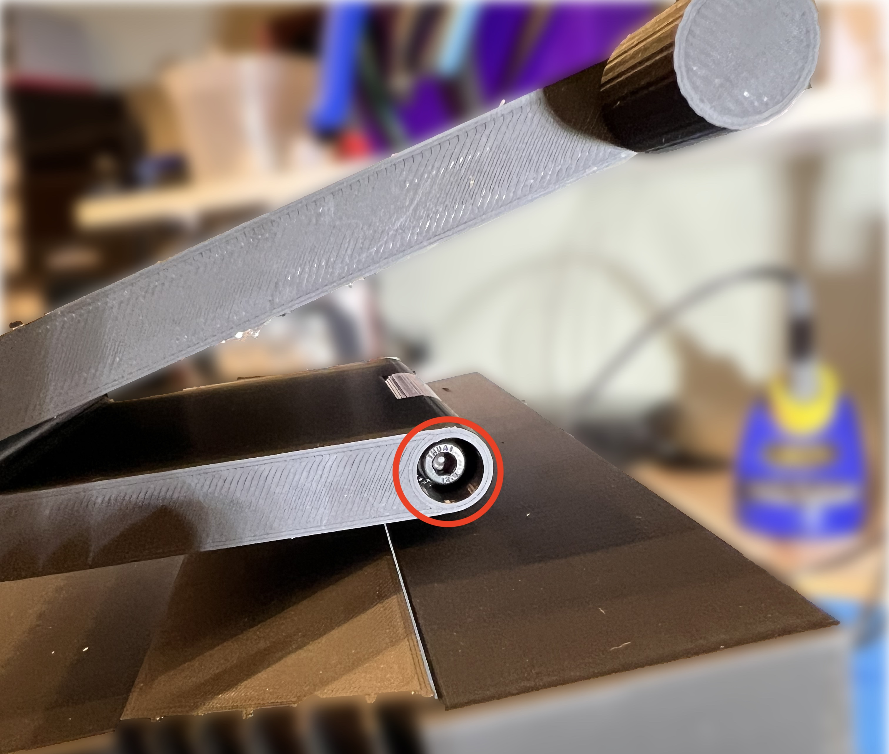](images/Assembly/HingeBolt.jpeg)
[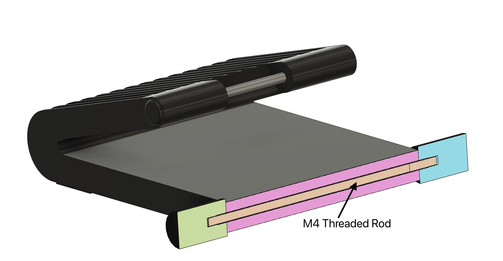](images/Assembly/HW/FootAxle.jpeg)
[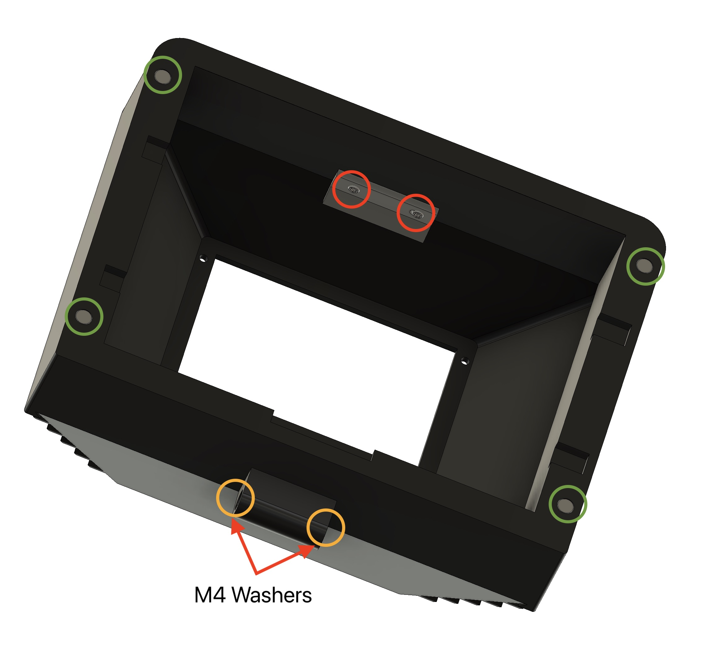](images/Assembly/HW/ShroudHW.jpeg)
[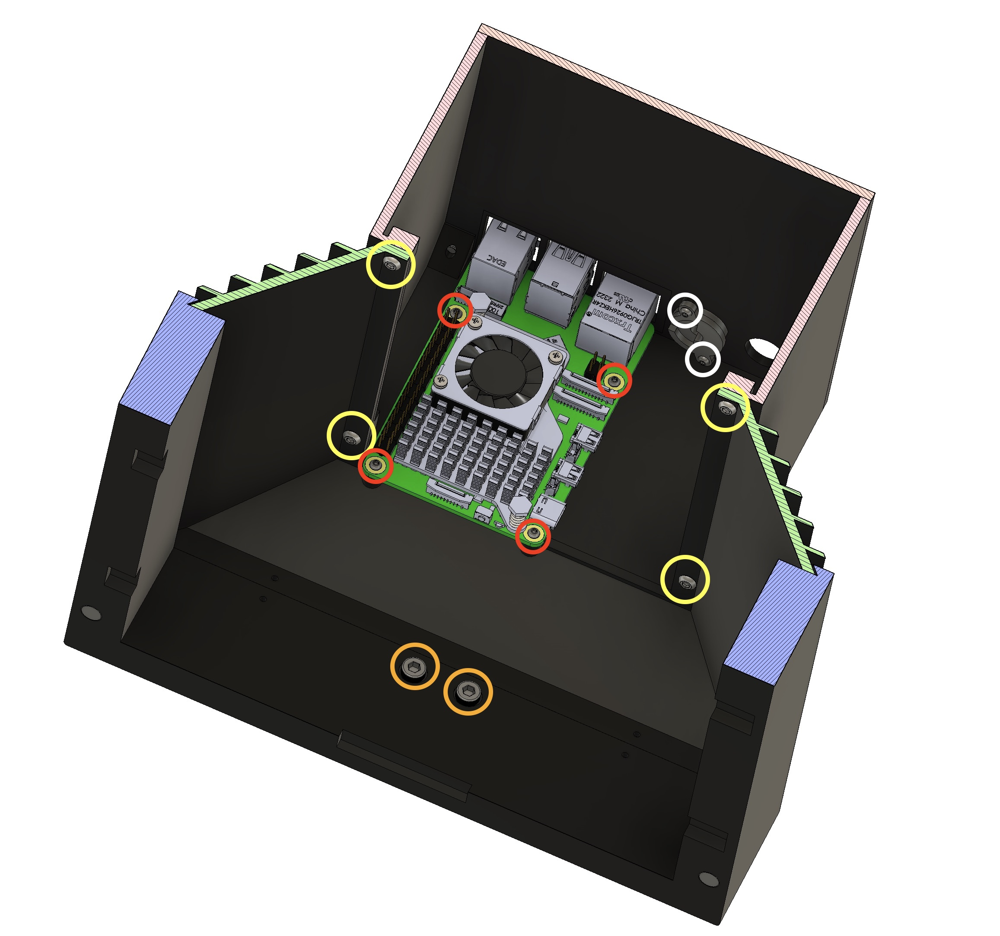](images/Assembly/HW/InnerScrews.jpeg)
[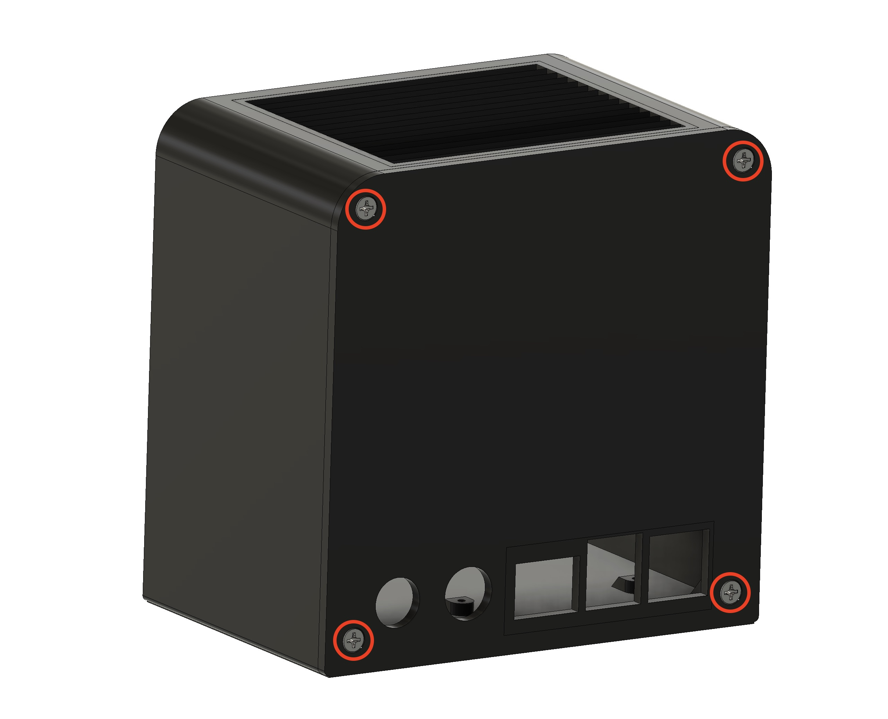](images/Assembly/HW/BackPlateScrews.jpeg)
[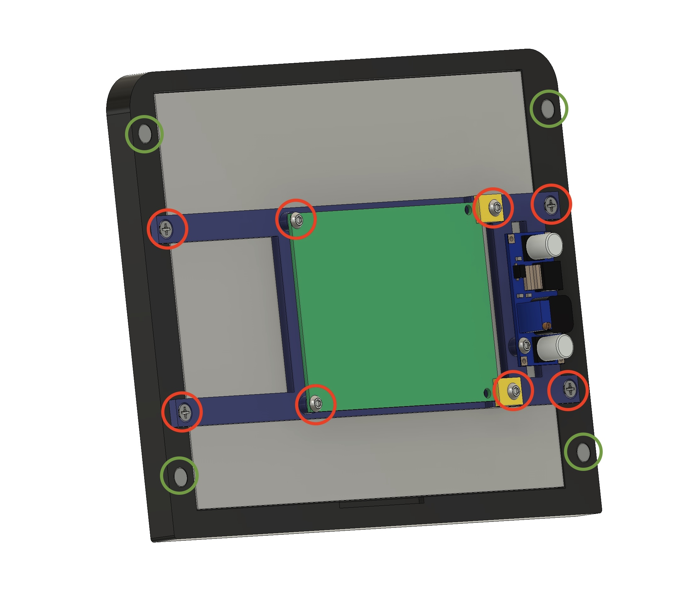](images/Assembly/HW/BezelHW.jpeg)
[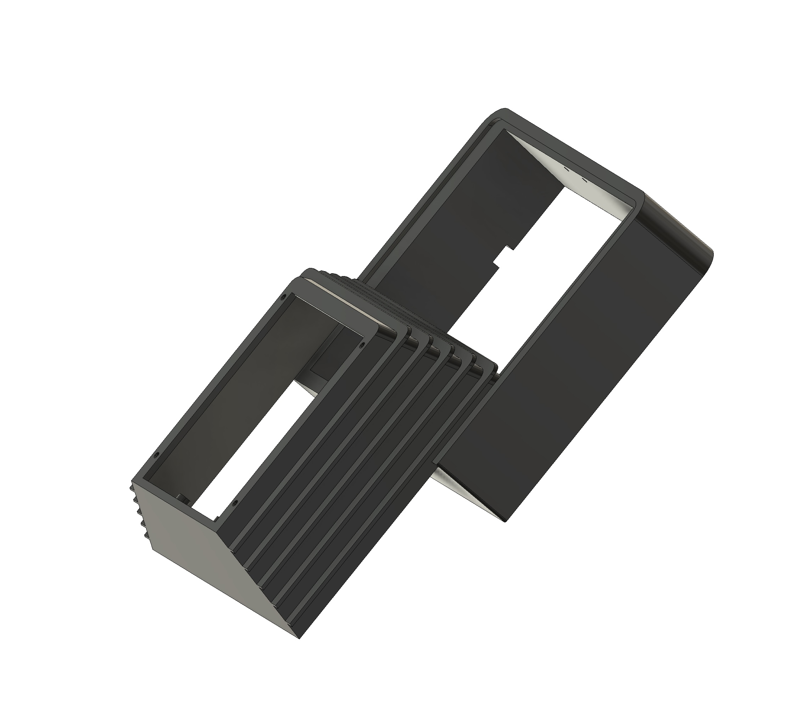](images/Assembly/SlideOnFins.gif)

## Wiring

The wiring is fairly simple as you can see in the photos. I will trace through the connections starting with the USB-C power from the power supply. Depending on how much you want to facilitate disassembly and changes, you may wish to use two prong connectors at certain spots. Refer to the images to see where I used connectors.

1. The USB-C connector from the power supply threads through the strain relief and connects directly to the Pi. You can do this right before screwing the *Back_Plate* to the *Rear_Shell*.
1. Power for the display is taken from the 5V pins of the Pi and connects to the input of the boost converter which is mounted to the *Display_Retainer*.
	* I use connector between the Pi and the boost converter for easier assembly (and disassembly).
	* Use two pairs of wires with Dupont connectors attached to the Pi's GPIO headers as [shown here](images/Wiring/GPIOConnections.jpeg).
	* The pair of red wires (5V) connects to the red side of a wired connector. The pair of black wires (ground) connects to the black side of the same wired connector.
	* The mating part of the wired connector goes to the input of the boost converter.
	* **Important**: Adjust the Boost Converter output to 12V. If the voltage is too high, it may damage your controller board.
1. Using one of the four-wire cables supplied with the display board, solder the white and yellow leads to the positive output of the boost converter. Solder the black and red leads to the negative output of the boost converter. I know this seems like odd use of colors, but this is how the connector on the display board is wired. Check the underside of your diplay board to be sure.
1. If you are using a Raspberry Pi 5 you can now add the soft power button. If you are using a Pi 4, skip this step.
  * Connect one side of a wired connector to the two terminals on the switch. Colors don't matter.
  * Solder the mating side of the wired connector to the [power button pads of the Pi](images/Wiring/Pi5PowerButtonPads.jpeg). Again, colors don't matter.
1. Connect the full size HDMI connector to the input of the display board.
1. Connect the other end of the HDMI cable to the Raspberry Pi. It has a micro HDMI connector.
1. Plug the end of the USB cable into the Raspberry Pi.

**Reference images**:

[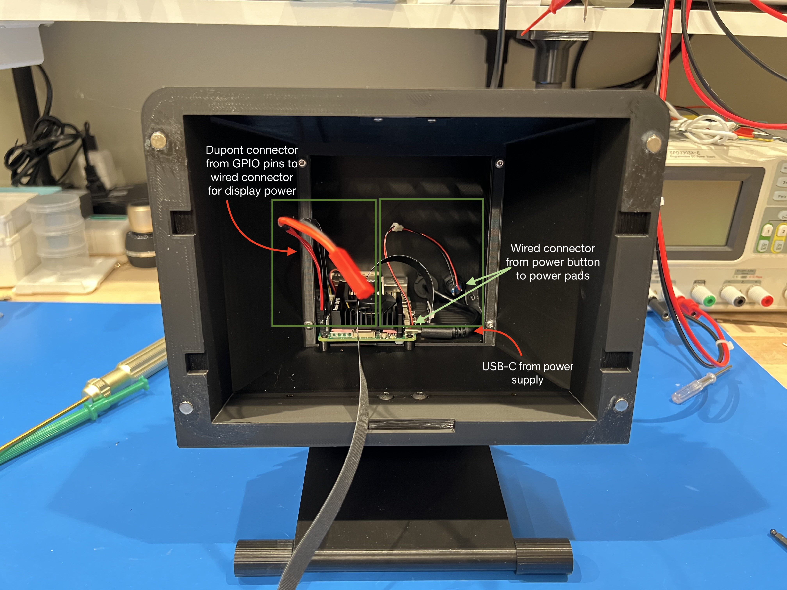](images/Wiring/RearWiring.jpeg)
[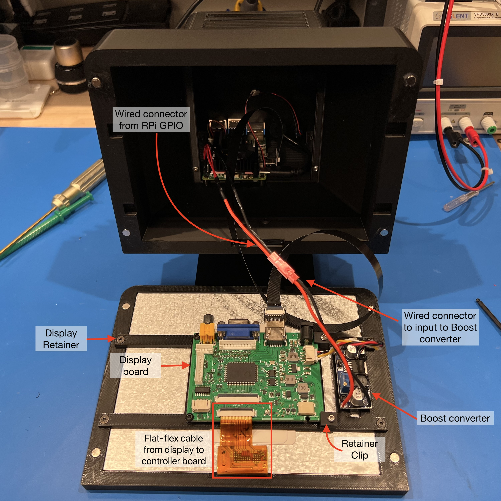](images/Wiring/FrontWiring.jpeg)
[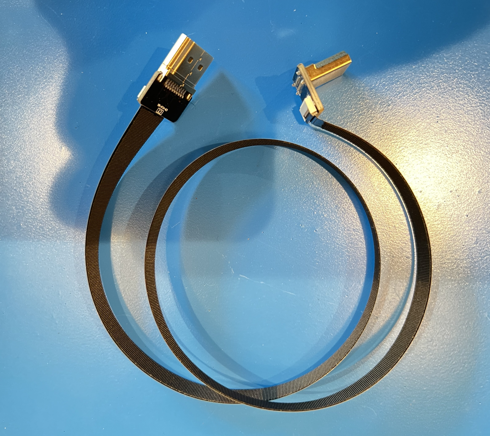](images/Wiring/HDMI_Cable.jpeg)

## Software Setup

* **Prepare Raspberry Pi OS**. Create an image of the Raspberry Pi OS that is appropriate for your Pi. Don't use the Lite version - you'll need the window system installed. I used the latest OS release as of August 2024, Bookworm. Boot the OS and customize as you like.
* **Adjust Screen Settings**: The display board comes with a control board with several buttons. The boards are connected to one another with supplied cable. You won't be using the control board in normal operation, but you may wish to connect it during initial setup to adjust things like input source, brightness, volume, etc. After that you can remove the control board and cable and only reattach it if needed.
* **Install the emulator**: Download, build, and install the "previous" NeXT emulator. The repository is here: [https://sourceforge.net/projects/previous/](https://sourceforge.net/projects/previous/). The repository contains notes on how to build and run the emulator.
* **Compute like it's 1988**:
	1. Find some [NeXT software](https://fsck.technology/software/NeXT/)
	2. Install it
	3. Let fun ensue 
