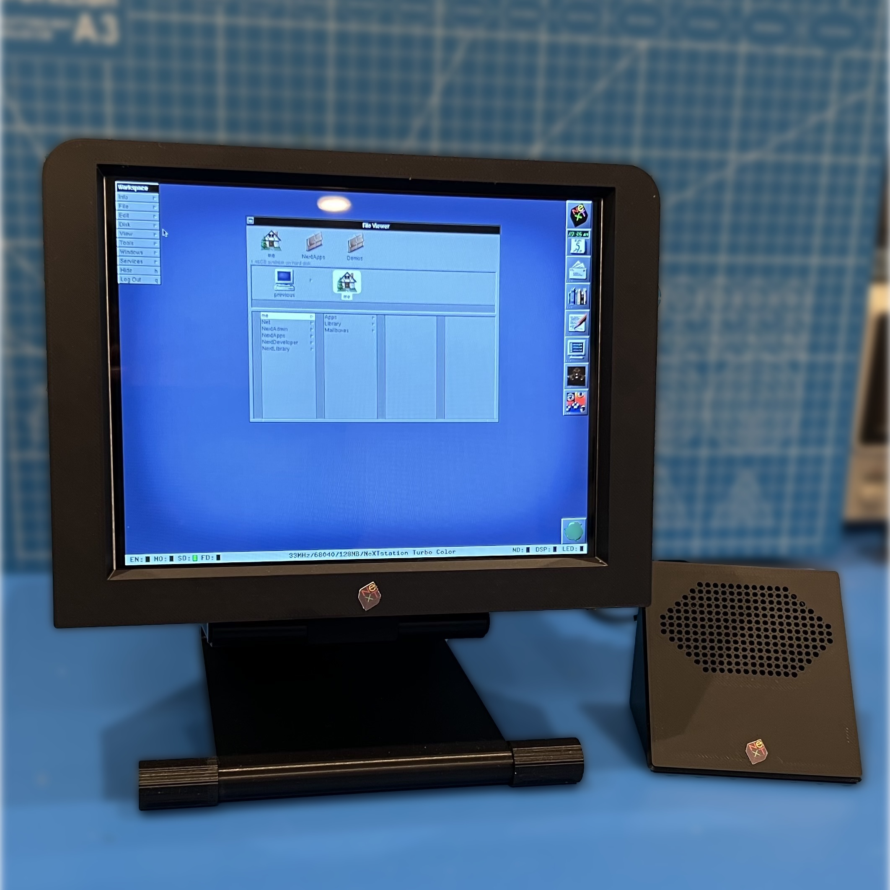

# Building the FauxNeXT SoundBox

These instructions describe the build of the NeXT SoundBox. Refer to instructions for the [main model here](Instructions.md). These instructions are a work-in-progress. As problems are noted or suggestions arise, I will update the instructions. Thank you for your patience. Throughout the Instructions when I am referring to a printed part, I will italicize the name. For example: *Lid*.

Here's the Sound Box alongside the MegaPixel Display (click for full size image). 

## Required Supplies

### Required Electronics (and where to source)

I don't have a great source for parts. I cobbled this together from an existing USB speaker and some slightly smaller individual speakers that fit into the available space.

* **USB Speaker Box**. I happened to have a couple of [these USB speakers](https://www.aliexpress.us/item/3256806049679984.html) from AliExpress, so I canabalized one to get the USB amplifier board and cable.
* **Speakers**. The speakers that come with the USB Speaker Box are slightly too big to fit easily into the FauxNeXT Sound Box. Instead I used a pair of small speakers that happened to come equipped with the proper connector to connect to the USB amplifier board. You can get a [pack of four from Amazon](https://www.amazon.com/gp/product/B0BTP67F81), but you'll only need two.

### Required Hardware

You will need very little hardware:

* (2) M3x6 countersunk screws to attach the lower part of *Back Plate* to the *Case*
* (2) M3x8 countersunk screws to attach the upper part of *Back Plate* to the *Case* and *Lid*

### Filament

I used PLA for all components, but for no other reason than it is what I normally use and my models won't be in an environment where the properties of other filaments will be required. If this turns out to be untrue, I will update this note.

* **Black**:
	* All of the parts are printed in black. I haven't color matched the original MPD. I've tried a couple of blacks and at the moment am using [Hatchbox](https://www.amazon.com/gp/product/B00J0ECR5I), but I plan to try a matte black as well and may update this note.
	* You should use the same filamanet that you used to print the MegaPixel Display

## Printing the Parts

This is a pretty easy print. All of the STLs will import into your slicer in the orientation in which I printed them. Components that need supports have “(NS)” in the name. I used tree supports and removing them was fairly easy. All parts may be printed with a 0.2mm layer height.

* ***Case(NS).stl***. This is the main case and it requires supports for the upper edge. Here's what my [supports looked like](images/SoundBox/CaseSupports.jpeg).
* ***Lid.stl***. This part has lots of small holes in the speaker grate. Your printer will most likely print the outline of each hole first on the first layer. Be sure your build plate is clean and has good adhesion so none of these outlines pop off.
* ***Back Plate.stl***. This part prints with the outside facing down to give the smoothest look.

## Assembly

After printing the parts, removing supports, and doing any other cleanup/post-processing that you deem necessary, you are ready to assemble the model. It's very straightforward as seen in the exploded view and cross-sections below.

All of the screws mount directly into the plastic of the model. Don't over-tighten.

2. USB amplifier board. You'll need to extract the usb amplifier board from the USB Speaker Box. To do this, pop out the [circular cover](images/SoundBox/USBSpeakerBoxBack.jpeg) from the back of the unit. Below it you'll see a screw. Remove it. Now that you have access to the interior, unplug the speakers from the board. Put those speakers aside for a future project. To free the board, you'll need to desolder the USB cable, remove the cable from the unit, then resolder it. Alternatively you can crack the plastic and extricate the cable that way. If you solder/desolder, pay close attention to which wire goes to which pad.
3. Mounting the Speakers. The speakers have [tabs on each side](images/SoundBox/SpeakerTabs.jpeg) for mounting purposes, but they are in the way for this project. Fortunately you can easily snap them off with a small amount of downward force on them. Once the tabs are moved, they will push into the rectangular areas inside the *Case*. Orient the speakers so the wires are facing the front. Refer to this [photo](images/SoundBox/Assembly.jpeg).
4. Wiring. Plug the mounted speakers into the amplifier board. Coil the extra wire and use a zip tie to keep them compact. Secure another zip tie tightly around the USB cable going to the amplifier board. It will act as a strain relief. In [this photo](images/SoundBox/Assembly.jpeg) the first zip tie is green and the second is red. The amplifier board does not need to be mounted to anything.
5. Test. Before you button up the assembly, plug the unit into a computer and test the functioanlity.
6. Button it up. As can be seen in the photos above, the *Lid* clips into the front of the *Case*. Once it is in place, put on the *Back Plate*. The M3x8 screws at the top thread through the *Case* and into the *Lid* to hold them all together. The bottom two screws just connect the *Back Plate* to the *Case*
7. Apply the NeXT Logo. Print the Logo with dimensions 7.9x10mm and adhere to the *Lid* in the small recessed area. A `.png` file of [the logo](Assets/Next Logo.png) is available in the `Assets` folder.

