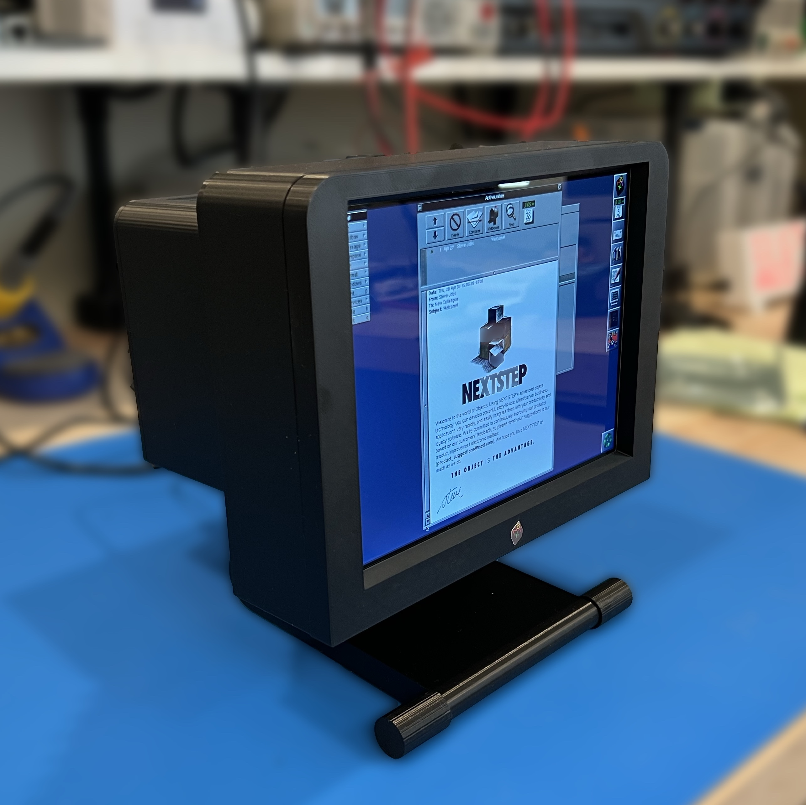

# FauxNeXT

This repository contains the instructions for building a 50% scale Faux [NeXT Computer](https://en.wikipedia.org/wiki/NeXT_MegaPixel_Display). At the moment, the repository contains only the NeXT MegaPixel Display (MPD) and a Sound Box, but in the future it will also be home to a 3D Model for a NeXTstation to go along with it. The display houses a Raspberry Pi which can run an emulator, named [**previous**](https://sourceforge.net/projects/previous/), that brings the NeXT software to life.

The MPD model is a reasonable facsimile of the original, but a number of liberties were taken to make the 3D printing process a little easier and to accomodate the 8" display and other electronics inside. Also, the original MPD display was grayscale, while the display used in this model can display full color. The NeXT color display was pretty generic and not very interesting to look at as a piece of retrocomputing technology.

You can use this model by itself to run Raspberry Pi software, including the NeXT emulator, or you can pair it with a future NeXTstation model to get the full effect. I have run the emulator on both a Raspberry Pi 4 and Pi 5. Unsurprisingly, the latter provides a better experience but is not strictly required. Take a look at a [short video](https://www.youtube.com/watch?v=qJ8GY28TO-4) of the model in operation. It refers to the model as "Beta 1". After some feedback and tweaks, I will update it to v1.

If you want to build your own, check out the [***instructions***](Instructions.md). That document desribes how to print, assemble, wire, and prepare software for FauxNeXT.

***THIS IS A WORK IN PROGRESS***: The documentation on required electronics, wiring, and software setup is not complete. At this point you should consider yourself an tester! Please let me know of an errors or ommissions.

The STL files for FauxNeXT can be found on [printables](https://www.printables.com/model/NNN).

***This model may not be used for commercial purposes as noted in the license***.

## Other Models

If your vintage computer tastes run more towards the TRS-80 line, check out the [Faux TRS](https://github.com/jpasqua/FauxTRS). If you're a DEC person, check out the [Faux VT100](https://github.com/jpasqua/FauxVT). For you classic Mac folks out there, take a look at the [Faux Mac](https://github.com/jpasqua/FauxMac).

## Potential Future Work

* **NeXTstation**: Create a printable 50% scale NeXTstation to go along with the MPD.
* **NeXT Cube**: Maybe...
* **External HDMI Connector**: It might be nice to be able to display on a larger screen when demonstrating the emulator to a group of people. Both the Pi 4 and 5 have a secondary HDMI port could go to an HDMI connector on the back panel.
